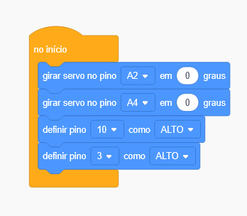
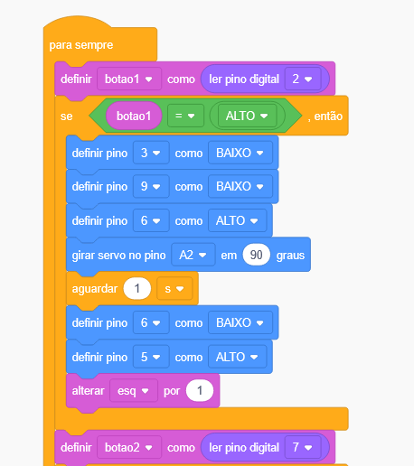
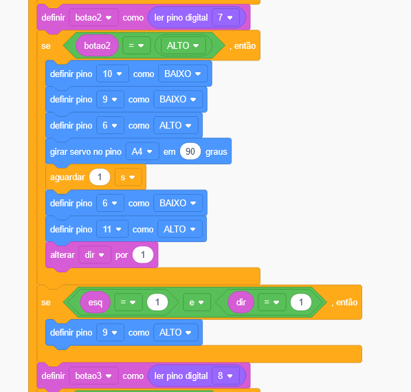
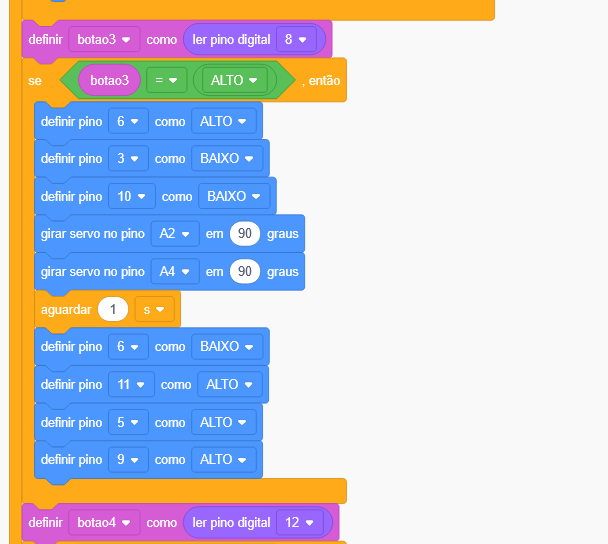
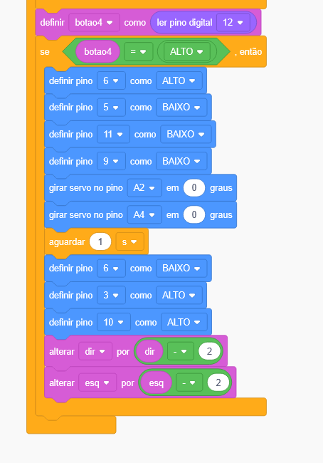

O sistema deve possuir 2 servo motores, 6 LEDs e 4 botões.

Quando o botão 1 for apertado, apenas o servo motor do lado esquerdo deve abrir. Ao mesmo tempo, o LED verde desse lado deve acender. Quando o servo motor estiver fechado, o LED vermelho deve estar aceso.

Quando o botão 2 for apertado, apenas o servo motor do lado direito deve abrir. Ao mesmo tempo, o LED verde desse lado deve acender. Quando o servo motor estiver fechado, o LED vermelho deve estar aceso.

Quando o servo motor de qualquer um dos lados estiver em movimento, o LED amarelo deve acender.

Quando o botão 3 for apertado, os dois portões se abrem. Nesse caso, o LED azul acende, indicando portão totalmente aberto.
Se esse botão não for pressionado, e os dois portões estiverem abertos, o LED azul irá se acender também.

Quando o botão 4 for apertado, os dois servo motores se fecham, e ambos os lados acendem o LED vermelho. Todos os LEDs além dos vermelhos se apagam.

Lista de passos:
Primeiro, conectei os leds e os botões.
Após conectei os servo motores. O pino de 5V foi usado para conectar ambos os servo motores, assim como os quatro botões.
Os LEDs foram conectador na seguinte ordem:
Vermelho esquerdo = pino 3
Verde esquerdo = pino 5
Amarelo = pino 6
Azul = pino 9
Vermelho direito = pino 10
Verde direito = pino 11

Na parte do código, criei 4 variáveis para os 4 botões.
Além disso, criei outras duas variáveis para armazenar um número, que representa se o portão está aberto ou não.
Quando o portão é aberto, a variável em questão recebe 1, quando é fechado, a variável volta a ser 0.


Código em blocos:

<p align="center">
  
</p>
<p align="center">
  
</p>
<p align="center">
  
</p>
<p align="center">
  
</p>
<p align="center">
  
</p>


Código em texto:

```bash
// C++ code
//
#include <Servo.h>

int botao1 = 0;

int botao2 = 0;

int botao3 = 0;

int botao4 = 0;

int esq = 0;

int dir = 0;

Servo servo_A2;

Servo servo_A4;

void setup()
{
  servo_A2.attach(A2, 500, 2500);
  servo_A4.attach(A4, 500, 2500);
  pinMode(10, OUTPUT);
  pinMode(3, OUTPUT);
  pinMode(2, INPUT);
  pinMode(9, OUTPUT);
  pinMode(6, OUTPUT);
  pinMode(5, OUTPUT);
  pinMode(7, INPUT);
  pinMode(11, OUTPUT);
  pinMode(8, INPUT);
  pinMode(12, INPUT);

  servo_A2.write(0);
  servo_A4.write(0);
  digitalWrite(10, HIGH);
  digitalWrite(3, HIGH);
}

void loop()
{
  botao1 = digitalRead(2);
  if (botao1 == HIGH) {
    digitalWrite(3, LOW);
    digitalWrite(9, LOW);
    digitalWrite(6, HIGH);
    servo_A2.write(90);
    delay(1000); // Wait for 1000 millisecond(s)
    digitalWrite(6, LOW);
    digitalWrite(5, HIGH);
    esq += 1;
  }
  botao2 = digitalRead(7);
  if (botao2 == HIGH) {
    digitalWrite(10, LOW);
    digitalWrite(9, LOW);
    digitalWrite(6, HIGH);
    servo_A4.write(90);
    delay(1000); // Wait for 1000 millisecond(s)
    digitalWrite(6, LOW);
    digitalWrite(11, HIGH);
    dir += 1;
  }
  if (esq == 1 && dir == 1) {
    digitalWrite(9, HIGH);
  }
  botao3 = digitalRead(8);
  if (botao3 == HIGH) {
    digitalWrite(6, HIGH);
    digitalWrite(3, LOW);
    digitalWrite(10, LOW);
    servo_A2.write(90);
    servo_A4.write(90);
    delay(1000); // Wait for 1000 millisecond(s)
    digitalWrite(6, LOW);
    digitalWrite(11, HIGH);
    digitalWrite(5, HIGH);
    digitalWrite(9, HIGH);
  }
  botao4 = digitalRead(12);
  if (botao4 == HIGH) {
    digitalWrite(6, HIGH);
    digitalWrite(5, LOW);
    digitalWrite(11, LOW);
    digitalWrite(9, LOW);
    servo_A2.write(0);
    servo_A4.write(0);
    delay(1000); // Wait for 1000 millisecond(s)
    digitalWrite(6, LOW);
    digitalWrite(3, HIGH);
    digitalWrite(10, HIGH);
    dir += (dir - 2);
    esq += (esq - 2);
  }
}


